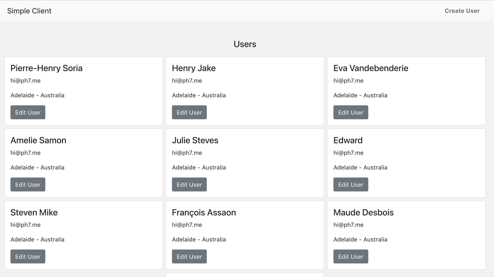

# ProjectU - React Client

A simple and elegant client built for my Udemy course available at: https://www.udemy.com/course/build-backend-api-node-js-and-react-frontend/

The client uses Bootstrap v5 (with React-Bootstrap components), React-Router v6, React Content Loader, and Styled Components.

## Setting Up

1. Make sure you have npm v6 or newer installed (by installing [NodeJS](https://nodejs.org/en/download)).
2. Run `npm ci` to install all dependencies.
3. `npm start` to start your React client application.

## Preview

## Author

I'm [Pierre-Henry Soria](https://ph7.me). A **Super Passionate** Belgian **Software Engineer** 🤗 And a true cheese 🧀 & chocolate 🍫 lover! 😋 You can always reach me at _hi {[AT]} ph7 [{D0T}] me_

  

## Context

This is the final and completed project of my [Udemy Course](https://www.udemy.com/user/pierresoria/), **Learn how to build a RESTful API with NodeJS, and a React client application**.

## License

Distributed under [MIT](https://opensource.org/licenses/MIT) license 🎉
